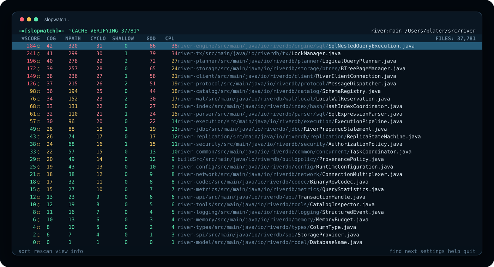

# Slopwatch

Slop causes us humans painful extra cognitive load, while agents have DEEP slop tolerance.
But we do see them drop in performance as slop causes reasoning chains to lengthen,
evidence to conflict, distraction to increase. Planning becomes more elaborate with more subtasks,
they start overlooking constraints more often, forgetting goals, and prioritising irrelvancies.

*Slopmark* is your quality measuring tool.
It finds design and abstraction smells in Go, Java, TypeScript, and Rust, giving the code a weighted score
based on coupling, cohesion, module depth, and cognitive complexity. It is not a substitute for a linter.
It is designed to be run by agents and lets you give them *one clear and simple KPI* to stop the descent to slop.
Give them a simple rule: keep the score under target, pass the gates, and rework anything over it until it is clean.

*Slopwatch* is your window into code health.
Use it to keep an eye on what is creeping upwards and how refactors are progressing.

## Install and usage

The Homebrew package includes the `slopmark` analyzer and `slopwatch` live dashboard:

```sh
brew tap blater/tap
brew install slopwatch
```

For a source checkout:

```sh
git clone https://github.com/blater/slopwatch.git
cd slopwatch
make build
```

Analyze one or more directories or files. Supported source files are `.go`,
`.java`, `.ts`, `.tsx`, `.mts`, `.cts`, and `.rs`:

```sh
slopmark src
slopmark myproj/src anotherProj/prod/src
```

Open the live dashboard with `slopwatch` (equivalent to `slopmark --follow`):

```sh
slopwatch --limit 200 .
```

In the dashboard, use the arrow keys or `j`/`k` to move, `v` to view the
selected file, `f` or `/` to find, `h` for help, and `q` to quit.



Common commands:

| Command | Purpose | Example |
| --- | --- | --- |
| `slopmark [TARGET ...]` | Analyze directories or files | `slopmark src` |
| `slopwatch [TARGET ...]` | Follow the live ranking dashboard | `slopwatch .` |

Common analysis options:

| Option | Purpose | Example |
| --- | --- | --- |
| `-c`, `--compact` | Show only score and path in text output | `slopmark --compact .` |
| `-f`, `--follow` | Open the live, scrollable ranking dashboard | `slopmark --follow --limit 100 .` |
| `--trend-window DURATION` | Set the follow-mode movement and edit-highlight window | `slopwatch --trend-window 30m .` |
| `--include-tests` | Include test source files | `slopmark --include-tests .` |
| `--limit NUMBER` | Return at most this many ranked files | `slopmark --limit 20 .` |
| `--pass-score SCORE` | Pass files scoring at or below this value | `slopmark --pass-score 100 .` |
| `--format json` | Emit the standard JSON report | `slopmark . --format json` |

`--pass-score` considers every analyzed file. Analysis returns 0 when all
files pass, 3 when any file does not pass, and 2 for analysis errors.

## Report measurements

Lower numbers are better. A routine is a function, method, or constructor.
`-` means that the analyzer does not supply that measurement. These short
descriptions are also available in the dashboard with `h`.

| Column | Meaning |
| --- | --- |
| `SCORE` | Weighted sum of all enabled metrics and rules. Lower is better |
| `COG` | Cognitive effort needed to understand nested decisions. Lower is better |
| `NPATH` | Number of possible execution paths. Lower is better |
| `CYCLO` | Cyclomatic complexity - independent control-flow paths. Lower is better |
| `SHALLOW` | Functionality delivered per unit of interface complexity. Higher is worse |
| `GOD` | Responsibility concentration in a type. Keep this low |
| `PATH` | Source file being measured |

### SCORE

`SCORE` adds the weighted contributions from the enabled components supported
for the file's language. It does not add the raw values shown in the report.

Type-safety checks are disabled in the dashboard score by default. They apply
only to TypeScript. To include them, enable `TYPE SAFETY` in Settings →
Columns. That column then shows the type-safety contribution for each file.

Deep-nesting checks are also disabled in the dashboard score by default. To
include them, enable `NESTING` in Settings → Columns. This keeps the separate
nesting penalty from silently adding to the nesting already reflected in COG.

```text
raw measurements
→ component aggregation
→ threshold and formula
→ weight
→ component contribution
→ SCORE
```

Below a component's threshold, its contribution is zero when its formula uses
a threshold. At or above the threshold, that formula sets the contribution.
For a component configured with `log-ratio`:

```text
contribution = weight × (1 + log₂(value / threshold))
```

The score sums component contributions through their configured axes. A
missing or unavailable component contributes zero and marks the file
incomplete; it does not silently become a raw zero measurement.

### COG — cognitive complexity

COG follows the Sonar/PMD cognitive-complexity model. It estimates the mental
effort needed to understand a routine. Starting at zero, the calculation adds:

```text
if/loop/switch          1 + current nesting depth
else                    1
new boolean sequence    1
conditional expression  1 + current nesting depth
labeled jump            1
recursion               1
```

Nesting increases while a structural decision's body is visited. The report
shows the maximum routine value and the number of routines measured.

### NPATH — NPath complexity

NPATH counts distinct acyclic execution routes through a routine. Statement
sequences compose their routes; branches add their outcomes; boolean and
conditional expressions contribute their short-circuit outcomes; loops retain
the zero-iteration route; and a switch sums its case routes plus the no-match
route when there is no default. The implementation uses arbitrary-precision
integers so large results do not overflow.

### CYCLO — cyclomatic complexity

CYCLO is PMD-style cyclomatic complexity:

```text
CYCLO = 1 + decision increments
```

An `if` or loop adds one, each non-default switch case adds one, boolean
`&&`/`||` and conditional expressions add one for each decision, and explicit
jumps and panics are accounted for where the language adapter exposes them.
The report shows the total across routines and the maximum routine value.

### SHALLOW — module shallowness penalty

SHALLOW is an Ousterhout-inspired penalty: a module is deeper when it provides
more useful functionality through a smaller caller-visible interface. Higher
SHALLOW is worse. The calculation uses a COSMIC-inspired static approximation
of functional capability, not LOC or private implementation size.

*Formula*
```text
F = Functionality
I = InterfaceCost
D = DepthRatio

F = entries + exits + reads + writes
I = public operation count
    + recursive costs of their parameter and result type shapes
    + public type/state surface costs
D = F / I

depth penalty = 100 × max(0, 1 - D / D_ref)
leakage penalty = 100 × min(1, exposed representation / I)
SHALLOW = round(clamp(0, 100,
    0.80 × depth penalty + 0.20 × leakage penalty))
```

An entry is data or an event supplied to a public operation. An exit is a
result or observable output. Reads and writes are recognized persistent-store
movements. The analyzer estimates these terms from public operations, their
signatures, public types, and exposed mutable representation.

`D_ref` is selected from caller-visible role evidence by the versioned
`role-shape-v2` policy. The report includes the raw `D`, the reference, and
the penalty components. A module with no identifiable public interface is
unavailable rather than being assigned a misleading zero.

For nested types, each wrapper and child contributes one. The structural
analyzers cap each type shape at 32 so one enormous type cannot dominate the
metric.

SHALLOW uses a threshold of `20`, a weight of `5`, and `log-ratio`. Therefore:

```text
SHALLOW < 20  → contribution 0
SHALLOW = 20  → contribution 5
SHALLOW = 40  → contribution 10
SHALLOW = 80  → contribution 15
```


### GOD — responsibility concentration

GOD uses PMD's God Class signal, generalized to the type systems supported by
each analyzer. A type is a candidate when all three conditions hold:

```text
WMC >= 47       weighted routine complexity is high
ATFD > 5        access to foreign data is high
TCC < 1/3       type cohesion is low
```

WMC is the sum of routine complexities, ATFD counts distinct foreign data
accesses, and TCC is the proportion of routine pairs sharing access to state.
The analyzer applies the test to the type-level declaration for which it has
the required evidence. This may be a class, struct, record, or interface,
depending on the language and analyzer. The displayed GOD value is the
weighted penalty for the candidate; zero means the combined conditions did not
trigger, and `-` means unavailable.

### PATH

PATH is the source path only; it is not a quality measurement.

## Release

Configure the `HOMEBREW_TAP_TOKEN` GitHub Actions secret, authenticate `gh`,
and run:

```sh
./release.sh X.Y.Z
```

The script requires a clean working tree and a version higher than the latest
local release tag. It tags and pushes the current commit, waits for the release
workflow, then verifies the GitHub assets and Homebrew formula. The workflow
builds and smoke-tests the packaged Go, Java, Rust, and TypeScript analyzers
before it publishes anything.
