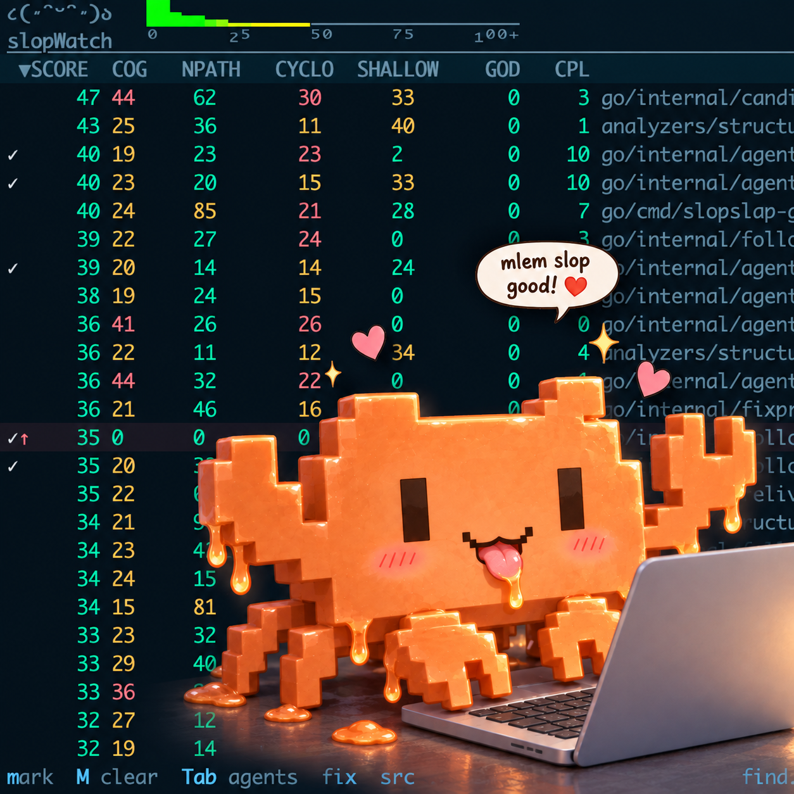
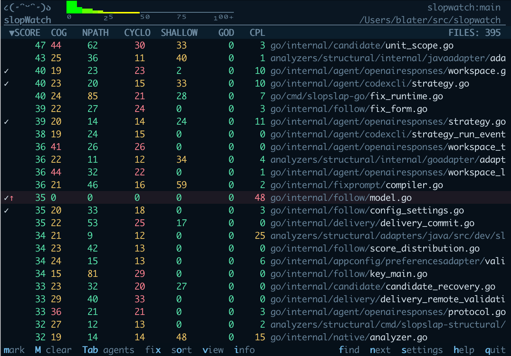

# SlopWatch:
* Code health at a glance
* A quality bar for your agents

_Slopwatch_ exists because I wanted two things when working with agent teams -
* to give the agents an objective measure of slop that I can tell them to keep below.
* to easily assess the level of slop in the codebase so that I know when to take the agents off task and push them to resolve their technical debt.

Agents get _slopmark_ (packaged with this) which performs fast static analysis on a codebase/branch/worktree and gives them an immediate, objective quality score. Its focus is on design smells for long term code health. 

For humans there's _slopwatch_ - like [btop](https://github.com/aristocratos/btop) but for code design smells. It is a TUI on top of slopmark which tracks and displays static analysis metrics and shows you code health at a glance - if its red its not good.

Slopwatch analyzes design and abstraction smells in Rust, Go, Typescript, and Java (please vote on what other languages you'd like to see), giving the code a weighted score based on coupling, cohesion, module depth, and cognitive complexity.
For new projects I give agents a specific slopmark target they cannot breach and give a measure/rework loop until the slopmark score passes. For mature projects they get a target of no regression combined with a limit for new code.

## Quick Install 

On a mac...
```sh
brew tap blater/tap
brew trust blater/tap
brew install slopwatch
```
See [Build & Install](#build-and-install) for details on installing on other platforms, or without needing to trust this tap.

## Slopwatch

run with `slopwatch <project path>` e.g. `slopwatch ~/src/slopwatch`



### keys

To navigate and use the dashboard:
* up/down arrow keys or `j`/`k` to move, 
* left/right arrows to scroll the file path,
* ^f/^b to jump forward/backward a page a time,
* `g`/`G` to goto the top or bottom file in the list, 
* `o` to choose what to sort by (aggregated score by default)
* `v` to view the selected file, 
* `f` or `/` to find a file,
* `n` or `N` to find the next occurance of the search string (n=down, N=upwards)
* `h` for topic-based help, 
* `q` to quit. 

### Settings 

Choose Settings → Appearance → Theme to switch between the dark and light themes.

Other settings that can be adjusted are: 
* columns displayed, 
* sorting defaults, 
* scoring weights, 
* interaction defaults,
* auto-fix agent and prompt parameters

These are stored a versioned, user-editable TOML file. See [Preferences](docs/preferences.md) for its location, complete schema, and command-line precedence rules.


## Report measurements

Lower numbers are better. A routine is a function, method, or constructor.
`-` means that the analyzer does not supply that measurement. 
These short descriptions are also available in the dashboard with the `h` "help" shortcut key.

| Column | Meaning |
| --- | --- |
| `SCORE` | Weighted sum of all enabled metrics and rules. Lower is better |
| `COG` | Cognitive effort needed to understand nested decisions. Lower is better |
| `NPATH` | Number of possible execution paths. Lower is better |
| `CYCLO` | Cyclomatic complexity - independent control-flow paths. Lower is better |
| `SHALLOW` | Caller burden relative to responsibility hidden behind the interface. Higher is worse |
| `CPL` | Maximum number of foreign types referenced by a type. Lower is better |
| `GOD` | Responsibility concentration in a type. Keep this low |
| `PATH` | Source file being measured |

See the [score details](#score-details) section for a full rundown.

## Slopmark

Slopmark is the raw command line tool and library that powers slopwatch, and is what agents should be directed to use.

use `slopmark [options] [TARGET ...]` to Analyze directories or files
e.g.
```sh
slopmark src
slopmark myproj/src anotherProj/prod/src
```
Supported source file extensions are `.go`, `.java`, `.ts`, `.tsx`, `.mts`, `.cts`, and `.rs`.

### *slopmark* command line options:

| Option | Purpose | Example |
| --- | --- | --- |
| `-c`, `--compact` | Show only score and path in text output | `slopmark --compact .` |
| `-f`, `--follow` | Open the live, scrollable ranking dashboard | `slopmark --follow --limit 100 .` |
| `--trend-window DURATION` | Set the follow-mode movement and edit-highlight window | `slopwatch --trend-window 30m .` |
| `--include-tests` | Include test source files | `slopmark --include-tests .` |
| `--follow-symlinks` | Follow symlinks found inside target directories; an explicitly named symlink target is always followed | `slopwatch --follow-symlinks src` |
| `--typescript-types` | Enable slower compiler-aware TypeScript type-safety analysis | `slopmark --typescript-types .` |
| `--limit NUMBER` | Return at most this many ranked files | `slopmark --limit 20 .` |
| `--pass-score SCORE` | Pass files scoring at or below this value | `slopmark --pass-score 100 .` |
| `--format json` | Emit the standard JSON report | `slopmark . --format json` |
| `--use-cache` | Reuse verified cached analysis units; without this, `slopmark` only updates the cache | `slopmark --use-cache .` |

`--pass-score` considers every analyzed file. Analysis returns 0 when all files pass, 3 when any file does not pass, and 2 for analysis errors.

Syntax errors are shown as `X` with per-file Info diagnostics.
Valid files continue to be measured; cross-file metrics affected by a broken sibling are marked incomplete and cannot pass their thresholds.

## Score Details

### SCORE

`SCORE` adds the weighted contributions from the enabled components supported
for the file's language. It does not add the raw values shown in the report.

Type-safety checks are disabled by default because constructing and validating
a repository-wide TypeScript compiler graph can dominate startup on mature
projects. They apply only to TypeScript. Enabling `TYPE SAFETY` in Settings → Appearance →
Columns automatically runs compiler-aware analysis and refreshes the dashboard;
no restart or extra flag is required. For non-interactive reports, or to preload
the graph before opening the dashboard, use `--typescript-types`.

Deep-nesting checks are also disabled in the dashboard score by default. To
include them, enable `NESTING` in Settings → Appearance → Columns. This keeps the separate
nesting penalty from silently adding to the nesting already reflected in COG.

```text
raw measurements
→ component aggregation
→ threshold and formula
→ weight
→ component contribution
→ SCORE
```

Below a component's threshold, its contribution is zero when its formula uses
a threshold. At or above the threshold, that formula sets the contribution.
For a component configured with `log-ratio`:

```text
contribution = weight × (1 + log₂(value / threshold))
```

The score sums component contributions through their configured axes. A
missing or unavailable component contributes zero and marks the file
incomplete; it does not silently become a raw zero measurement.

The follow dashboard's two line header includes a `0..100+` score distribution.
The aggregate keeps five point buckets with a separate `100+` overflow bucket;
the available header width resamples those buckets into the visible bar cells,
keeping the overflow as the final cell. The second line labels the score range
under the bars when the labels fit (⁰, ²⁵, ⁵⁰, ⁷⁵, ¹⁰⁰⁺). Bar height is proportional to the largest
visible bucket. Cached or provisional results remain as a grey silhouette until
a current verification replaces them. The graph and the repository/workspace
labels share the remaining header width; long right labels keep their suffix
with a twenty-cell floor where the terminal permits.

### COG — cognitive complexity

COG follows the Sonar/PMD cognitive-complexity model. It estimates the mental
effort needed to understand a routine. Starting at zero, the calculation adds:

```text
if/loop/switch          1 + current nesting depth
else                    1
new boolean sequence    1
conditional expression  1 + current nesting depth
labeled jump            1
recursion               1
```

Nesting increases while a structural decision's body is visited. The report
shows the maximum routine value and the number of routines measured.

### NPATH — NPath complexity

NPATH counts distinct acyclic execution routes through a routine. Statement
sequences compose their routes; branches add their outcomes; boolean and
conditional expressions contribute their short-circuit outcomes; loops retain
the zero-iteration route; and a switch sums its case routes plus the no-match
route when there is no default. The implementation uses arbitrary-precision
integers so large results do not overflow.

### CYCLO — cyclomatic complexity

CYCLO is PMD-style cyclomatic complexity:

```text
CYCLO = 1 + decision increments
```

An `if` or loop adds one, each non-default switch case adds one, boolean
`&&`/`||` and conditional expressions add one for each decision, and explicit
jumps and panics are accounted for where the language adapter exposes them.
The report shows the total across routines and the maximum routine value.

### SHALLOW — module depth

The default profile is `responsibility-v4`. Use
`--score-profile=legacy-signature-v3` with either executable to compare against
the previous measure. V4 is being delivered incrementally: the responsibilities
described below are the intended model, and some remain unimplemented. See the
[current capabilities and backlog](docs/shallow-v4-interim-release.md), including
the substantial Java coverage gaps observed on River.

SHALLOW measures module "depth". This is the John Ousterhout suggestion of how to measure how good an interface/API is. If it abstracts a lot of complexity behind a simple interface it is better (deeper), if the amount of work going on in the backend is low compared to the complexity of the interface it is worse (shallower).

In summary: how much work an interface leaves to its callers compared with how much it handles for them (the caller burden).

The caller's burden includes the operations and concepts they must understand, inputs and decisions they must supply, and steps they must perform in order.
Exposing writable internal state adds to that burden. On the other side, the analyzer follows implementation and resolved calls for evidence of work handled inside: validating inputs, translating errors, managing resources and private state, coordinating concurrent access, and transforming data.

The descriptive burden/depth ratio is separate from the 0–100 SHALLOW defect penalty:
```text
B = weighted caller burden
H = weighted hidden responsibility
descriptive ratio = round(100 × B / (B + 2 × H))
```

A penalty requires specific adverse evidence; neither a high ratio nor missing
analysis establishes a defect. Current detection covers unnecessary required
inputs, with observed caller evidence or source-based inference. Zero means no
finding established, not proven exceptional depth.

For example, an operation that opens a resource, uses it and handles cleanup
hides more responsibility than an interface that leaves those steps to the caller.
Repeated checks, extra loops and forwarding layers do not earn extra credit for the same work. 
Defaults that simplify access to the same service can reduce caller burden.

*Details*
The unit measured is the usable API, which may span several files and include inherited or delegated behavior. 
Moving a helper to another file does not make it deeper. 
The file display shows its highest associated boundary score; shared boundaries count once in aggregate scoring. 
Supporting contract members are assessed with the service they support, while passive data carriers and allocation-only factories are not assigned a depth penalty. 
Recognized type constraints, defensive copies and useful adaptation are also taken into account.

*Caveats (there are many)*
This is an engineering estimate, not a verdict on design. It measures the kinds of responsibility hidden, not algorithmic sophistication: a small calculation and a substantial computation can receive the same credit. 
The weights are policy choices, not an empirically calibrated scale. Ordinary heuristic results are labelled **Estimated**. Specific material limitations and support for individual findings are shown separately; semantic incompleteness does not replace an applicable numeric rating. `–` means the metric does not apply.
The **info** view popup gives more details to explain the evidence and any gaps.
An unavailable SHALLOW measurement does not hide SCORE: the aggregate uses the
other available components, while SHALLOW retains its `X` indicator.

_This is a score best used as a composite component of the overall score_ - it's not one you should blindly tell an agent to optimize for on its own, as it is a lot more nuanced than say, the GOD metric.

*Score Contribution*
With the default threshold of `20`, weight of `5` and `log-ratio` scoring,
SHALLOW below 20 contributes nothing to SCORE; values of 20, 40 and 80 contribute
5, 10 and 15 respectively.

### CPL — type coupling

How tightly coupled is the module/class/file.  CPL shows the maximum number of distinct foreign types referenced by any type in the file. The displayed value is the raw coupling measurement; scoring uses the separately configured contribution. With the default threshold of `20`, values below `20` remain visible in CPL even though they contribute zero to SCORE.


### GOD — responsibility concentration

Has it got (much) too many responsibilities? GOD uses PMD's God Class signal, generalized to the type systems supported by each analyzer. A type is a GOD candidate when all 3 of these conditions hold:

```text
WMC >= 47       weighted routine complexity is high
ATFD > 5        access to foreign data is high
TCC < 1/3       type cohesion is low
```

WMC is the sum of routine complexities, ATFD counts distinct foreign data accesses, and TCC is the proportion of routine pairs sharing access to state.
The analyzer applies the test to the type-level declaration for which it has the required evidence. This may be a class, struct, record, or interface, depending on the language and analyzer. 
The displayed GOD value is the weighted penalty for the candidate; zero means the combined conditions did not trigger, and `-` means unavailable.


## Agent-assisted fixes

This feature is alpha. You can highlight files in the slopwatch file browser and request an agent to lower its score. This spins off an agent with a prompt to fix the marked files, along with a prompt and some guardrails:

The prompt uses a template which can be changed in Settings → Agents → Fix Settings → Agent prompt.  It uses placeholders such as {targets}, {target_score}, {focus_metrics}, {baseline_scores}, and {target_checklist}.

The guardrails prohibit gaming scores by sharding files, relocating complexity, or emptying targets.  These are currently nothing complex - simply added to the prompt, and rely on the agent following instructions. This will get more attention in the future if agent-assisted-fixes turns out to be a useful feature.

I'll write up a proper description, but in the meantime, enjoy Codex's description - it has written a lot, so I think it was quite proud of this one:

```
 Install the Codex CLI, run `codex login`, then highlight a file and press `x`.
 Codex sign-in supports ChatGPT accounts and is the built-in default; it does
 not require an OpenAI API key. The Fix form lets you choose the score target,
 one or more focus metrics, allowed edit scope, agent profile, model, effort,
 delivery workflow and branch name. The global master prompt is editable in
 Fix Defaults and is the complete prompt sent to the agent; SlopWatch only
 substitutes its documented data placeholders.

 The alternative `OpenAI Responses API — API key` profile uses
 `env:OPENAI_API_KEY`; API usage is billed separately from ChatGPT. That adapter
 has no shell, process, Git or ambient filesystem access: candidate reads and
 writes pass through SlopWatch-controlled tools. SlopWatch never silently falls
 back between the Codex/ChatGPT and direct API-key routes. Codex uses its local
 App Server with a workspace-write sandbox, streamed activity and per-job
 `turn/interrupt` cancellation.

 Fix can edit the current files—including a dirty Git tree or a folder outside
 source control—or use a separate worktree. Git is optional. Commit, push and
 pull request are separate choices; local changes are the default. Press `Tab` to
 switch between Files and Agents, or `A` to jump to Agents. Expand a job to see
 its targets and compact metric state; `C` cancels only the selected eligible
 job. Agent completion is not treated as success: SlopWatch freshly analyzes
 the candidate and continues automatically until the target is met.

 Settings groups options under Agents, Appearance, and Static Analysis. Agent Setup presents one row per
 provider, marks unavailable integrations and highlights the active one.
 Selecting a provider opens a provider-specific connection dialog and starts
 an automatic readiness check; only a successful connection becomes active.
 Connection settings store only provider-owned login state or authentication
 references such as `env:OPENAI_API_KEY`, never the credential itself. Operational
 constraints are visible settings: concurrency, retention and actor limits are
 global; provider turn/tool/token/file/context budgets belong to the selected
 agent profile.
 Model turns, tool calls and token checks default to no SlopWatch-imposed cap,
 active attempts have no wall-clock timeout or attempt cap, and Cancel is the
 only job action.

 Pull-request delivery (draft or ready for review, as configured) additionally requires
 `SLOPWATCH_FIX_GH_EXECUTABLE` to name the canonical absolute path of a
 non-writable GitHub CLI outside the repository. SlopWatch resolves `gh`
 authorization and the exact `github.com/owner/repository` target when selected
 publication actually runs; it does not block Fix preparation or admission and
 does not select either CLI from the ambient `PATH`.
```

## Build And Install
The Homebrew package includes the `slopmark` analyzer and `slopwatch` live dashboard:

```sh
brew tap blater/tap
brew install slopwatch
```
You'll probably need to run brew trust to trust this tap, if you prefer not to, then you can also build from source.


Build from source (requires Git, Make, Go 1.25+, Rust/Cargo, a full JDK—CI uses
JDK 25—and Node.js 22+ with npm):

```sh
git clone https://github.com/blater/slopwatch.git
cd slopwatch
go -C go mod download
make build

./build/slopwatch .
# Or: ./build/slopmark .
```
Run the executables from `build/`; keep the checkout's supporting analyzer files in place.

The TypeScript analyzer requires Node.js 22 or newer. Homebrew installs that runtime dependency automatically.
